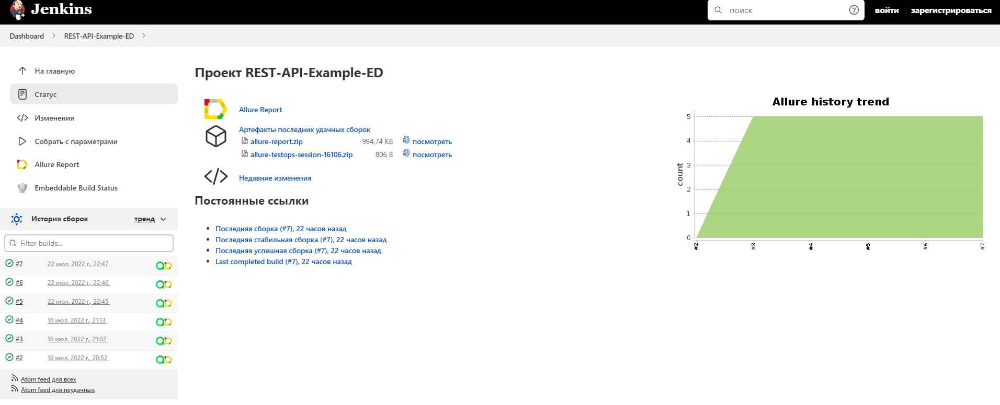
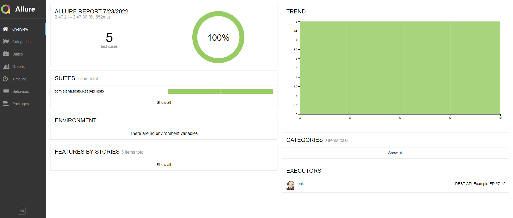
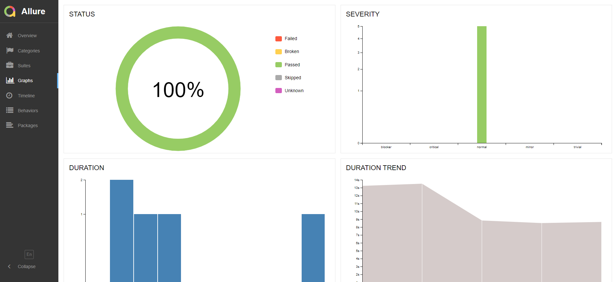
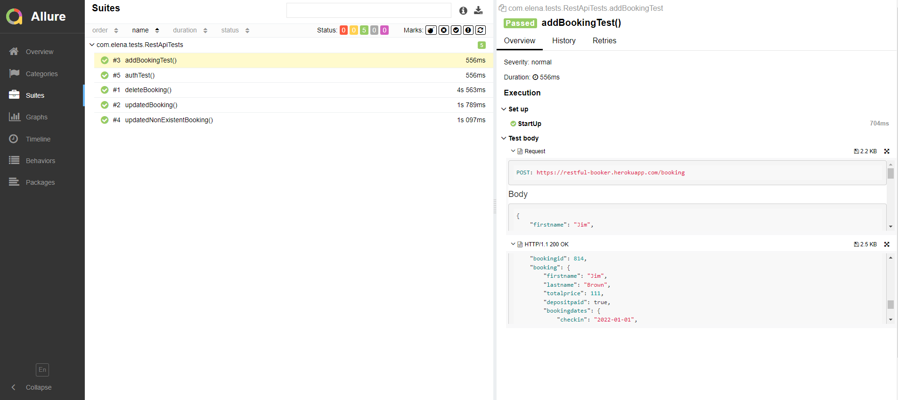
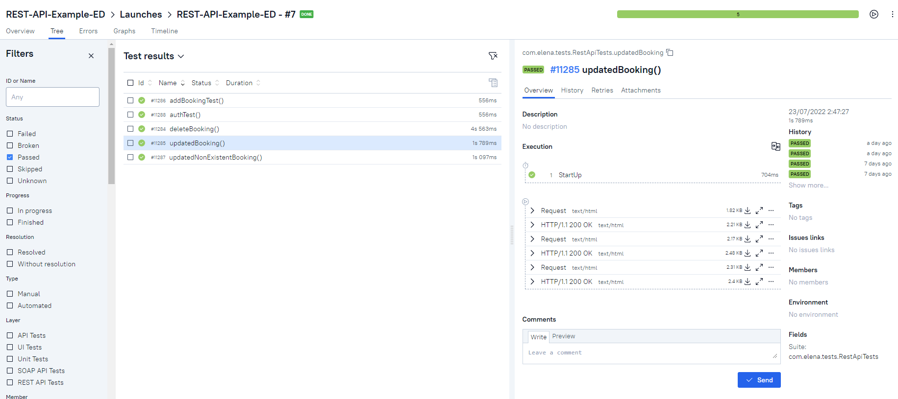
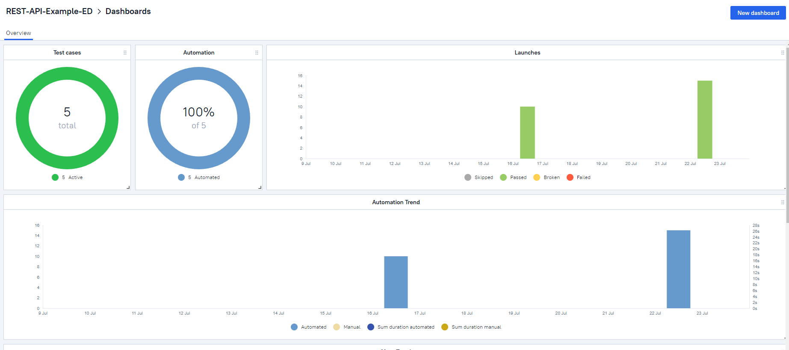
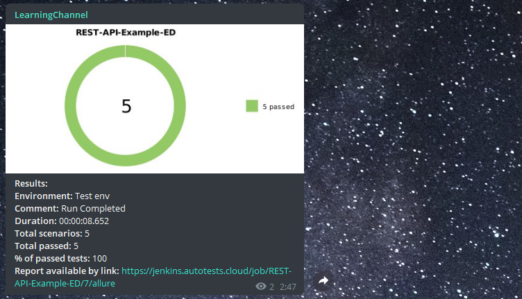

# Тестовый проект по автоматизации тестирования API https://restful-booker.herokuapp.com/. 

## :memo: Содержание:

- [Реализованные проверки](#boom-Реализованные-проверки)
- [Технологии](#classical_building-Технологии)
- [Сборка в Jenkins](#man_cook-Jenkins-job)
- [Запуск из терминала](#electron-Запуск-тестов-из-терминала)
- [Allure отчет](#bar_chart-Allure-отчет)
- [Allure TestOps](#bar_chart-alluretestops)
- [Telegram Notifications](#robot-telegram)


## :boom: Реализованные проверки

- ✓ Проверка логина
- ✓ Проверка добавления нового бронирования
- ✓ Проверка апдейта существующего бронирования
- ✓ Попытка апдейта несуществующего бронирования
- ✓ Проверка удаления бронирования

## :classical_building: Технологии

<p align="center">


</p>

## :man_cook: Jenkins job
</a>  <a target="_blank" href="https://jenkins.autotests.cloud/job/REST-API-Example-ED/">Jenkins job</a>
<p align="center">
<a href="https://jenkins.autotests.cloud/job/REST-API-Example-ED/"></a>
</p>

## :electron: Запуск тестов из терминала

```
gradle clean test
```

## :bar_chart: Allure-отчет
</a> Отчет в <a target="_blank" href="https://jenkins.autotests.cloud/job/C01-elena_alexandrovna31-MobileUI/4/allure/">Allure report</a>
<p align="center">
<a href="https://jenkins.autotests.cloud/job/REST-API-Example-ED/7/allure/"></a>
</p>
<p align="center">
<a href="https://jenkins.autotests.cloud/job/REST-API-Example-ED/7/allure/"></a>
</p>
<p align="center">
<a href="https://jenkins.autotests.cloud/job/REST-API-Example-ED/7/allure/"></a>
</p>

## :bar_chart: AllureTestOps
</a> Отчет в <a target="_blank" href="https://allure.autotests.cloud/project/1469/dashboards">Allure TestOps</a>
<p align="center">

</p>
<p align="center">

</p>

## :robot: Telegram
</a> Уведомления в Telegram
<p align="center">

</p>
